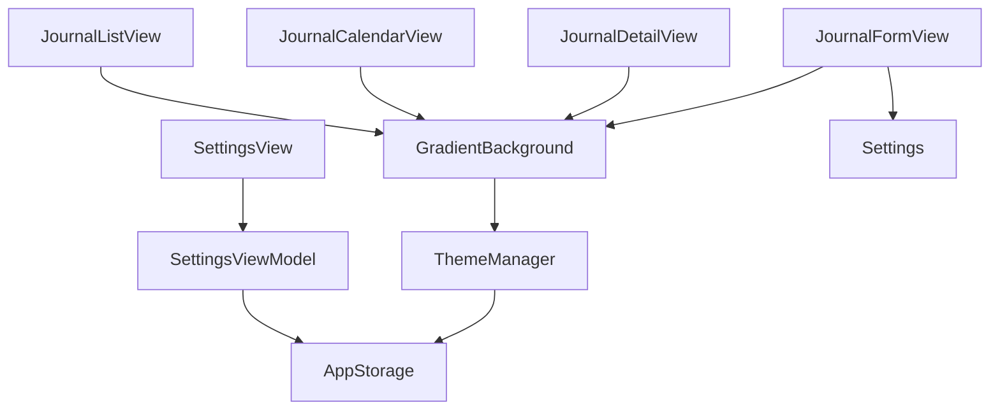

# Settings Implementation Plan

## Overview
This document outlines the implementation plan for the Rflect app's settings functionality, including journal title visibility toggle and gradient background color customization.

## Architecture Components

### 1. Data Layer
#### SettingsViewModel
```swift
class SettingsViewModel: ObservableObject {
    @AppStorage("showJournalTitle") var showJournalTitle = true
    @AppStorage("gradientStartColor") var gradientStartColor: Color = .blue
    @AppStorage("gradientMiddleColor") var gradientMiddleColor: Color = .purple
    @AppStorage("gradientEndColor") var gradientEndColor: Color = .pink
}
```

#### ThemeManager
```swift
class ThemeManager: ObservableObject {
    @AppStorage("gradientStartColor") static var startColor: Color = .blue
    @AppStorage("gradientMiddleColor") static var middleColor: Color = .purple
    @AppStorage("gradientEndColor") static var endColor: Color = .pink
}
```

### 2. View Layer
#### SettingsView
- Toggle for showing/hiding journal title
- Color pickers for gradient colors
- Live preview of gradient with current colors

#### Modified Views
- GradientBackground: Updated to use ThemeManager colors
- JournalFormView: Modified to respect title visibility setting
- Other views: Updated to use themed gradient background

## Implementation Steps

1. Create SettingsViewModel for managing settings state
2. Implement ThemeManager for global gradient colors
3. Update SettingsView with all controls
4. Modify GradientBackground to use theme colors
5. Update JournalFormView to respect title visibility
6. Update all views using GradientBackground

## Architecture Diagram


## Integration Points
- GradientBackground.swift
- JournalFormView.swift
- JournalListView.swift
- JournalCalendarView.swift
- JournalDetailView.swift

## Persistence
Using SwiftUI's @AppStorage for storing user preferences:
- showJournalTitle: Bool
- gradientStartColor: Color
- gradientMiddleColor: Color
- gradientEndColor: Color