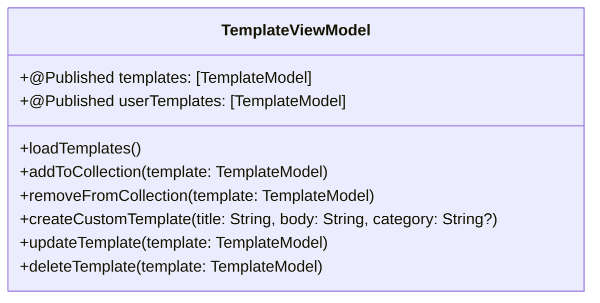
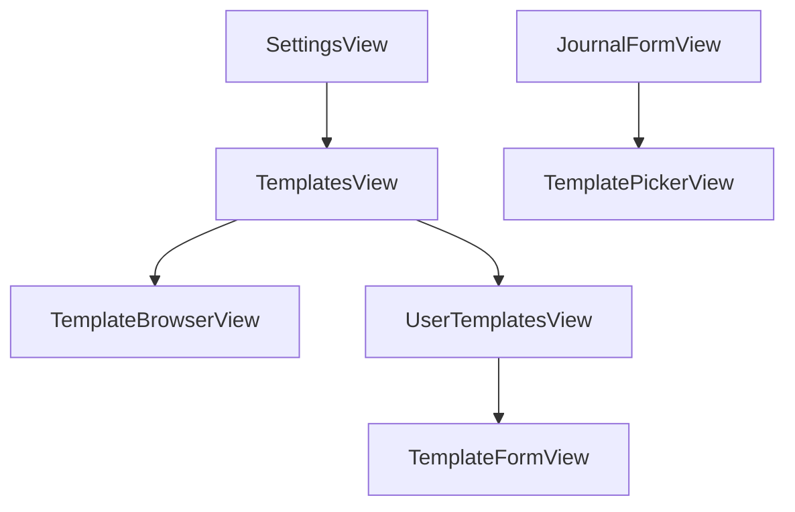

# Journal Templates Feature Implementation Plan

## Overview
This document outlines the implementation plan for the Journal Templates feature in Rflect. The feature will allow users to select from pre-defined templates or create custom ones to streamline their journaling process.

## Current Architecture Analysis

### Existing Components
- `TemplateModel`: Basic template model with `id`, `title`, `body`, and `isAdded` properties
- `JournalFormView`: Main journal entry form that will integrate template selection
- `SettingsView`: Will host template management features

## Implementation Plan

### 1. Model Enhancement

#### Update TemplateModel.swift
```swift
@Model
class TemplateModel {
    @Attribute(.unique) var id: UUID
    var title: String
    var body: String
    var category: String?
    var isCustom: Bool
    var isAdded: Bool
    var createdAt: Date
    
    init(id: UUID = UUID(), 
         title: String, 
         body: String, 
         category: String? = nil,
         isCustom: Bool = false, 
         isAdded: Bool = false) {
        self.id = id
        self.title = title
        self.body = body
        self.category = category
        self.isCustom = isCustom
        self.isAdded = isAdded
        self.createdAt = Date()
    }
}
```

### 2. ViewModels

#### Create TemplateViewModel.swift


### 3. Views Structure


#### New View Components

1. **TemplatesView**
   - Main templates section in Settings
   - Navigation to browser and user templates

2. **TemplateBrowserView**
   - Grid/list of available templates
   - Add to collection functionality
   - Category filtering
   - Search functionality

3. **UserTemplatesView**
   - List of saved templates
   - Create/edit/delete custom templates
   - Template management

4. **TemplateFormView**
   - Form for creating/editing custom templates
   - Title, content, and category inputs

5. **TemplatePickerView**
   - Horizontal scrolling template cards in JournalFormView
   - Quick template preview and selection

### 4. Implementation Phases

#### Phase 1: Core Template Management
1. Update TemplateModel with new fields
2. Implement TemplateViewModel with CRUD operations
3. Create basic TemplatesView in Settings

#### Phase 2: Template Browser
1. Implement TemplateBrowserView
2. Add template collection management
3. Create category filtering system

#### Phase 3: Custom Templates
1. Build TemplateFormView
2. Implement custom template creation/editing
3. Add template validation

#### Phase 4: Journal Integration
1. Create TemplatePickerView component
2. Integrate template selection in JournalFormView
3. Implement template application logic

### 5. User Experience Considerations

1. **Template Discovery**
   - Categorized browsing
   - Search functionality
   - Preview capabilities

2. **Template Management**
   - Clear add/remove actions
   - Easy access to custom templates
   - Intuitive editing interface

3. **Journal Integration**
   - Seamless template selection
   - Non-intrusive UI
   - Clear preview of template content

### 6. Technical Considerations

1. **Data Management**
   - SwiftData integration for template persistence
   - Proper error handling
   - Data migration strategy

2. **Performance**
   - Efficient template loading
   - Smooth scrolling in template picker
   - Responsive search/filter operations

3. **Testing**
   - Unit tests for TemplateViewModel
   - UI tests for critical user flows
   - Preview providers for all new views

## Questions for Discussion

1. Should we implement template categories as an enum or free-form tags?
2. Do we want to support template versioning?
3. Should templates support rich text formatting?
4. Do we need a limit on custom template creation?